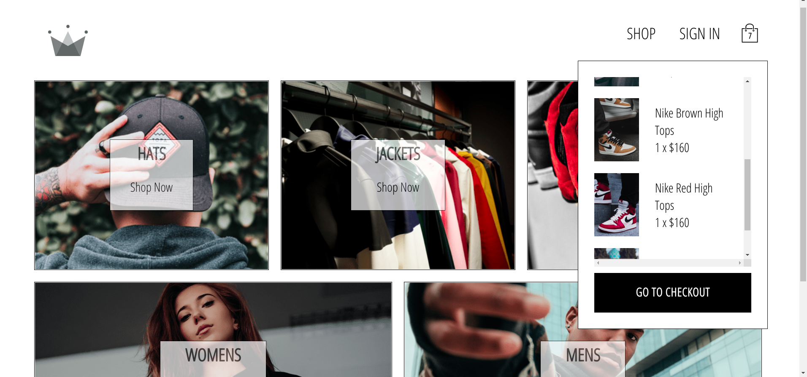

# Clothing shop react app

Sample online store website offering several categories of items, with add to cart capabilities and stripe payments.

## Technologies used: 

1. React

2. Redux, Redux Saga

3. Styled Components

4. Firebase SDK

5. Stripe API

## Deploy: 

Deployed with [Netlify](https://clothing-shop-project.netlify.app/)

## Screens:

